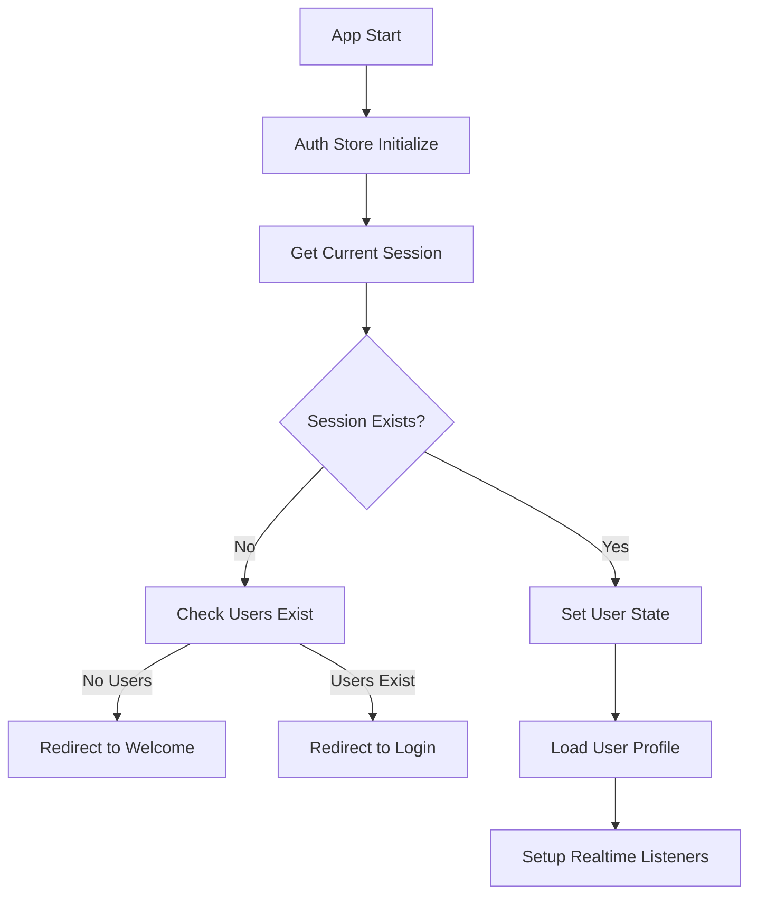
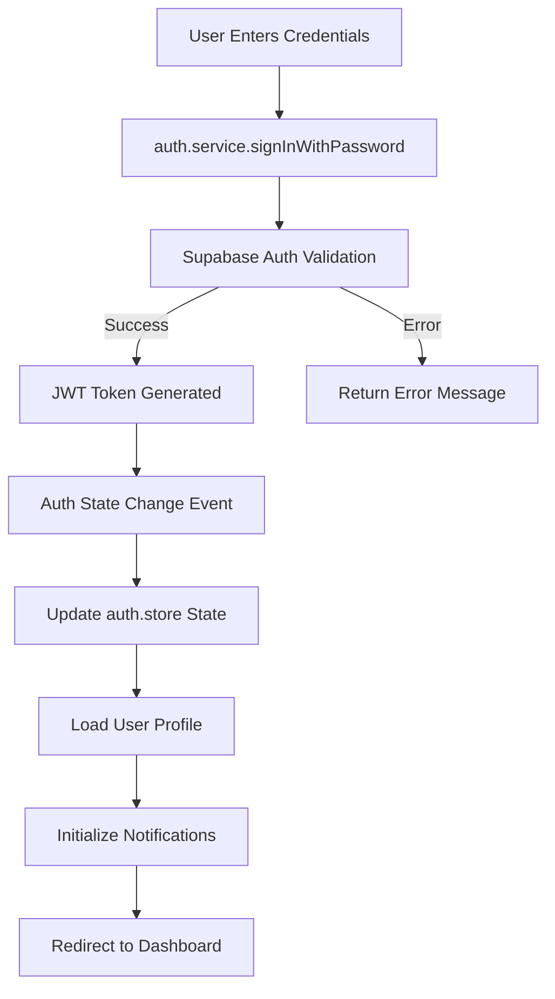
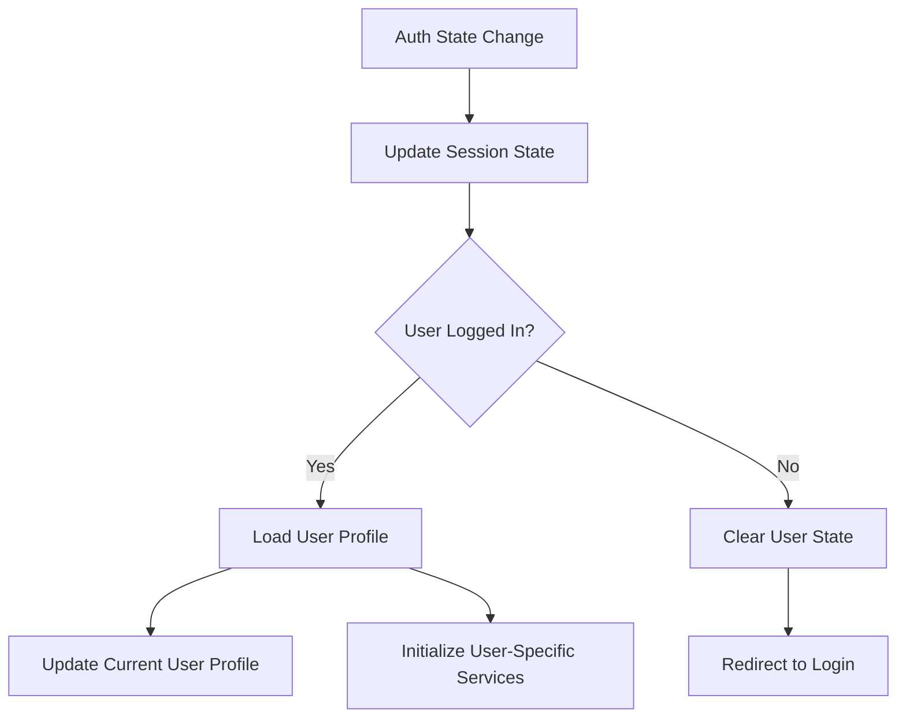
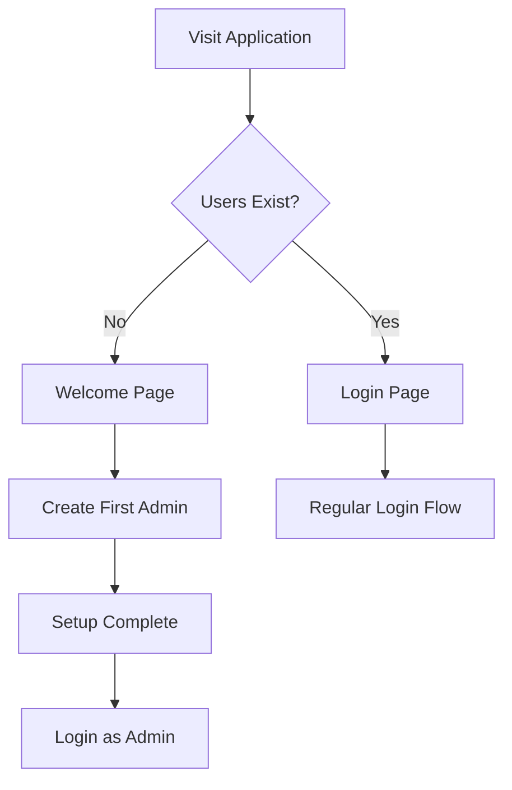

# SciCloud - User Authentication & Session Management Architecture

## Overview

This document details the user management, authentication, and session handling architecture in SciCloud. The system is built on Supabase Auth with custom user profiles and role-based access control.

## Authentication System Architecture

### Core Components

```
Frontend Layer:
├── LoginPage.vue           # User authentication interface
├── auth.store.ts          # Authentication state management
├── auth.service.ts        # Authentication API communication
└── user.store.ts          # User profile management

Backend Layer:
├── Supabase Auth          # JWT-based authentication
├── user_profiles table    # Extended user information
├── RLS Policies           # Row-level security
└── Edge Functions         # Secure user operations
```

## User Model & Profile System

### Dual User System
The application uses a dual-user system combining Supabase's built-in authentication with custom user profiles:

1. **Supabase Auth User** (`auth.users`)
   - Core authentication data (email, password, phone)
   - JWT token generation and validation
   - Session management
   - Built-in security features

2. **User Profile** (`user_profiles`)
   - Extended user information
   - Role-based permissions
   - Application-specific metadata

### User Profile Schema

```sql
CREATE TABLE user_profiles (
  id UUID PRIMARY KEY REFERENCES auth.users(id) ON DELETE CASCADE,
  first_name TEXT NOT NULL,
  last_name TEXT NOT NULL,
  biography TEXT DEFAULT '',
  location TEXT DEFAULT '',
  full_address TEXT DEFAULT '',
  avatar_url TEXT,
  role TEXT NOT NULL DEFAULT 'user' CHECK (role IN ('admin', 'user'))
);
```

### Unified User View
The system provides a unified view combining both authentication and profile data:

```typescript
// Combined User type from user_view
export type User = {
  id: string
  email: string | null      // From auth.users
  phone: string | null      // From auth.users
  created_at: string | null // From auth.users
  updated_at: string | null // From auth.users
  first_name: string        // From user_profiles
  last_name: string         // From user_profiles
  biography: string         // From user_profiles
  location: string          // From user_profiles
  full_address: string      // From user_profiles
  avatar_url: string | null // From user_profiles
  role: 'admin' | 'user'    // From user_profiles
}
```

## Authentication Flow

### 1. Application Bootstrap


### 2. Login Process


### 3. Session Management


## Authentication Store (`auth.store.ts`)

### State Management
```typescript
const session = ref<Session | null>(null)
const user = ref<SupabaseUser | null>(null)
const loading = ref(false)
const error = ref<string | null>(null)
const isInitialized = ref(false)

// Computed properties
const isAuthenticated = computed(() => !!session.value?.user)
```

### Key Methods

#### `initialize()`
- Gets current session from Supabase
- Sets up authentication state listeners
- Handles application bootstrap

#### `login(credentials: LoginCredentials)`
- Authenticates user with email/password
- Delegates to auth service
- Updates handled by state listener

#### `logout()`
- Signs out current user
- Clears session state
- Handles cleanup

#### `setupAuthStateListener()`
- Listens to Supabase auth state changes
- Automatically updates store state
- Single source of truth for authentication status

## User Management System

### User Store (`user.store.ts`)

#### State Management
```typescript
const users = ref<User[]>([])                     // All users cache
const currentUserProfile = ref<User | null>(null) // Current user profile
const loading = ref(false)
const error = ref<string | null>(null)
```

#### Key Operations

##### User CRUD Operations
- `getUser(userId: string)`: Fetch single user profile
- `getAllUsers()`: Fetch all users (admin only)
- `createUser(userData)`: Create new user via Edge Function
- `updateProfile(userId, profileData)`: Update user profile
- `deleteUser(userId)`: Delete user via Edge Function

##### Profile Management
- `updateEmail(newEmail)`: Update user email
- `updatePassword(currentPassword, newPassword, userEmail)`: Change password
- `updatePhone(newPhone)`: Update phone number

##### User Discovery
- `searchUserID(query)`: Search users by name
- `checkUsersExist()`: Check if any users exist (bootstrap)

### User Service (`user.service.ts`)

#### Security Model
The UserService implements a secure approach to user management:

1. **Profile Access**: Uses `get_user_profile()` function with permission checks
2. **Admin Operations**: Uses Edge Functions for secure server-side execution
3. **Role Updates**: Uses `admin_update_user_role()` function with admin verification
4. **Password Verification**: Re-authenticates before password changes

## Role-Based Access Control (RBAC)

### Role System
- **Admin**: Full system access, user management, configuration
- **User**: Standard access to features and personal data

### Permission Enforcement

#### Frontend Level
```typescript
// Router guards
const requiresAdmin = to.matched.some(record => 
  record.meta?.requiresAdmin === true
)

if (requiresAdmin && userProfile.role !== 'admin') {
  next('/error/403')
}
```

#### Database Level
```sql
-- Admin-only function example
CREATE FUNCTION admin_update_user_role(target_user_id uuid, new_role text)
RETURNS boolean
SECURITY DEFINER
AS $$
BEGIN
  IF NOT public.is_admin_user(auth.uid()) THEN
    RAISE EXCEPTION 'Unauthorized: Only admins can change user roles';
  END IF;
  -- Update logic here
END;
$$;
```

## Security Implementation

### Row Level Security (RLS)

#### User Profile Policies

### Password Security
- Supabase handles password hashing and validation
- Password change requires current password verification
- Strong password policies enforced at application level

### Session Security
- JWT tokens with automatic refresh
- Secure httpOnly cookies
- Session timeout handling
- Global logout capability (`signOut({ scope: 'global' })`)

## Route Protection System

### Route Meta Configuration
```typescript
declare module 'vue-router' {
  interface RouteMeta {
    requiresAuth?: boolean
    requiresAdmin?: boolean
    title?: string
  }
}
```

### Navigation Guards
```typescript
router.beforeEach(async (to, _from, next) => {
  const requiresAuth = to.matched.some(record => 
    record.meta?.requiresAuth !== false
  )
  const requiresAdmin = to.matched.some(record => 
    record.meta?.requiresAdmin === true
  )

  // Authentication check
  if (requiresAuth && !authStore.isAuthenticated) {
    next('/login')
    return
  }

  // Admin permission check
  if (requiresAdmin && userProfile.role !== 'admin') {
    next('/error/403')
    return
  }

  next()
})
```

## User Onboarding Flow

### First-Time Setup


### Welcome Page Features
- Checks if any users exist in the system
- Provides first-time setup if no users found
- Redirects to login if users already exist
- Creates initial admin account

## Error Handling & Edge Cases

### Authentication Errors
- Invalid credentials
- Account locked/disabled
- Network connectivity issues
- Token expiration

### Session Management
- Automatic token refresh
- Graceful degradation on network issues
- Proper cleanup on logout
- Cross-tab synchronization

### User Profile Errors
- Profile not found
- Permission denied
- Validation errors
- Concurrent update conflicts

## Best Practices & Patterns

### Authentication State Management
1. **Single Source of Truth**: Auth state managed in one store
2. **Reactive Updates**: Automatic UI updates on auth changes
3. **Error Boundary**: Consistent error handling across components
4. **Loading States**: User feedback during async operations

### Security Best Practices
1. **Never Trust Client**: All security enforced at database level
2. **Least Privilege**: Users get minimal necessary permissions
3. **Defense in Depth**: Multiple layers of security checks
4. **Audit Trail**: All user actions logged and traceable

### Performance Optimization
1. **Profile Caching**: User profiles cached in store
2. **Lazy Loading**: Route-level code splitting
3. **Efficient Queries**: Minimal database round-trips
4. **Reactive Updates**: Only re-render when necessary

## Testing Strategy

### Authentication Testing
- Unit tests for auth service methods
- Integration tests for login/logout flows
- E2E tests for complete user journeys
- Security testing for permission enforcement

### User Management Testing
- Profile CRUD operations
- Role-based access control
- Edge function security
- Error handling scenarios

## Monitoring & Analytics

### Authentication Metrics
- Login success/failure rates
- Session duration statistics
- User activity patterns
- Security violation attempts

### User Management Metrics
- User registration trends
- Role distribution
- Profile completion rates
- Feature usage analytics
